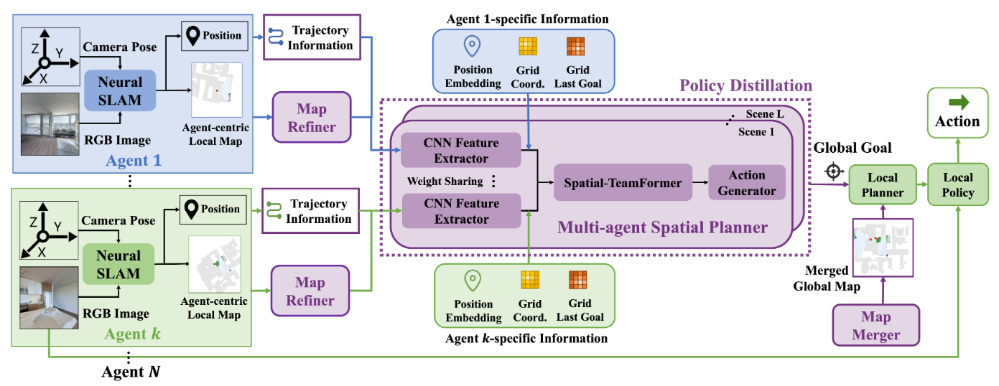

# Learning Efficient Multi-Agent Cooperative Visual Exploration

This is a PyTorch implementation of the paper: [Learning Efficient Multi-Agent Cooperative Visual Exploration](https://arxiv.org/abs/2110.05734)

Chao Yu*, Xinyi Yang*, Jiaxuan Gao*, Huazhong Yang, Yu Wang, Yi Wu

Tsinghua University

Project Website: https://sites.google.com/view/maans


## Overview

Multi-Agent Active Neural SLAM (MAANS) consists of 6 components:
- Neural SLAM module
- Map Refiner
- Spatial Coordination Planner
- Map Merger
- Local Planner
- Local Policy

As shown in following figure, the Neural SLAM module processes RGB input image and sensor readings and produces map prediction as well as agent's pose estimation. The Map Refiner does transformations on predicted maps to align representation. The Spatial Coordination Planner outputs a long-term goal. Then, based on a merged gloal map produced by the Map Merger, the Local Planner plans a path to the long-term goal and generates a short-term sub-goal. Finally the Local Policy outputs a navigational action to reach the short-term sub-goal.



## Installing Dependencies

Install basical dependencies as following,

```
pip install torch==1.5.1+cu101 torchvision==0.6.1+cu101 -f https://download.pytorch.org/whl/torch_stable.html
pip install wandb icecream setproctitle gym seaborn tensorboardX slackweb psutil slackweb pyastar2d einops
pip install -i https://pypi.tuna.tsinghua.edu.cn/simple magnum scikit-image==0.17.2 lmdb scikit-learn==0.24.1 scikit-fmm yacs imageio-ffmpeg numpy-quaternion numba tqdm gitpython attrs==19.1.0 tensorboard
```

Under root directory of this repository, run

```
pip install -e .
```

We use a modified version of [habitat-sim](https://github.com/facebookresearch/habitat-sim) and [habitat-lab](https://github.com/facebookresearch/habitat-lab), so please follow our instructions to set up habitat simulator.

```
git submodule update --init --recursive
cd habitat/habitat-sim
./build.sh --headless # make sure you use sh file!!!!!!
cd habitat/habitat-lab
pip install -e .
# if you failed to install habitat-api, you can use `build.sh --headless` instead.
```

Remember to add PYTHONPATH in your ~/.bashrc file:
```
export PYTHONPATH=$PYTHONPATH:/PATH_TO_THIS_PROJECT/maans/onpolicy/envs/habitat/habitat-sim/
```

## Data Setup

Please download the [Gibson](http://gibsonenv.stanford.edu/database/) 3D indoor dataset following instructions from [here](https://github.com/facebookresearch/habitat-api#data).

The dataset should be put in the directory `onpolicy/envs/habitat/data` in following format:

```
scene_datasets/
  gibson/
    Adrian.glb
    Adrian.navmesh
    ...
datasets/
  pointnav/
    gibson/
      v1/
        train/
        val/
        ...
```

## Pretrained Models

For Nerual SLAM module and Local Policy, download the models via
```
wget --no-check-certificate 'https://drive.google.com/uc?export=download&id=1A1s_HNnbpvdYBUAiw2y1JmmELRLfAJb8' -O pretrained_models/model_best.local;
wget --no-check-certificate 'https://drive.google.com/uc?export=download&id=1o5OG7DIUKZyvi5stozSqRpAEae1F2BmX' -O pretrained_models/model_best.slam;
```

## Training

You could start training with by running `sh train_habitat.sh` in directory [onpolicy/scripts](onpolicy/scripts). You can also set model parameters, model architecture and try out different input representations for SCP. 

## Evaluation

Similar to training, you could run `sh eval_habitat.sh` in directory [onpolicy/scripts](onpolicy/scripts) to start evaluation. Remember to set up your path to the cooresponding model, correct hyperparameters and related evaluation parameters. 

We also provide our implementations of planning-based baselines. You could run `sh eval_habitat_ft.sh` to evaluate the planning-based methods. Note that `algorithm_name` determines the method to make global planning. It can be set to one of `mappo`, `ft_rrt`, `ft_apf`, `ft_nearest` and `ft_utility`.

You could also visualize the result and generate gifs by adding `--use_render` and `--save_gifs` to the scripts.

## Citation
If you find this repository useful, please cite our [paper](https://arxiv.org/abs/2110.05734):
```
@misc{yu2021learning,
      title={Learning Efficient Multi-Agent Cooperative Visual Exploration}, 
      author={Chao Yu and Xinyi Yang and Jiaxuan Gao and Huazhong Yang and Yu Wang and Yi Wu},
      year={2021},
      eprint={2110.05734},
      archivePrefix={arXiv},
      primaryClass={cs.CV}
}
```
